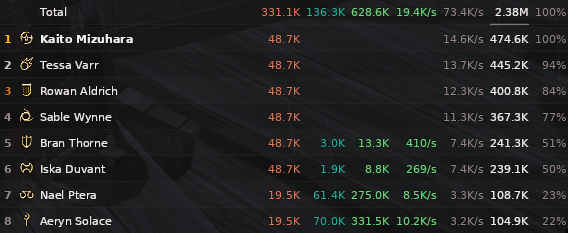
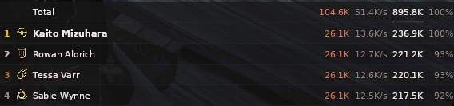
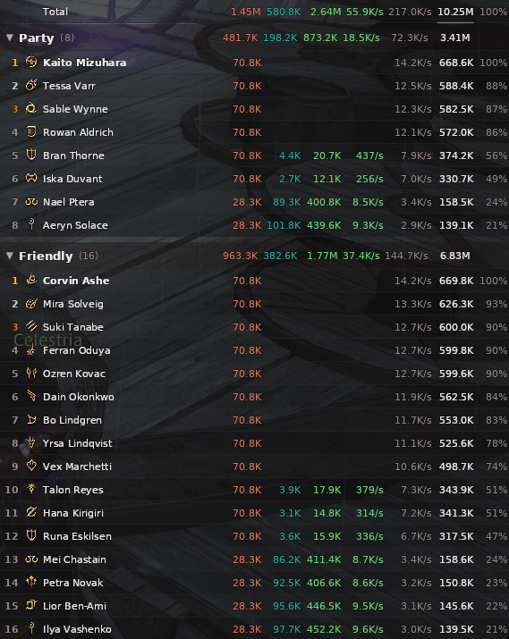

# Minimal Meter

[](https://github.com/linusfr/ffxiv-minimal-meter/releases/latest)
[](https://github.com/linusfr/ffxiv-minimal-meter/actions/workflows/ci.yml)
[](LICENSE)

> A damage meter that shuts up and shows you the numbers.

Most FFXIV meters want to be a dashboard: panels, gradients, title bars, a strip
along the top reminding you this is a damage meter. Minimal Meter is the same
parser with the furniture taken out: no title bar, no toolbar, no window chrome
— just a bar per player over the game, on a scrim as light as you like.



No ACT. No IINACT required. No browser overlay. One plugin.

<details>
<summary>More sizes</summary>

Light party — the columns you enable, and nothing else:



Alliance raid, split into groups with per-group sums in the headers:



</details>

## Credit

**A reskin of [Sansflaire/DamageMeter](https://github.com/Sansflaire/DamageMeter).**
Sansflaire wrote the hard parts — the ActionEffect hook, the bit-level effect
decoding, the DoT simulator, the Skia render pipeline. Go star their repo.

Added here: the chrome-free single style, DoT/HoT attribution for other players,
IINACT as an optional source, optional per-metric columns, click-to-sort, grow
direction, auto-hide by context, alliance grouping, and a pass over some
inherited crashes and races.

## Install

### Dalamud repo (recommended — auto-updates)

`/xlsettings` → **Experimental** → Custom Plugin Repositories → paste, `+`, then
click the **save** icon:

```
https://raw.githubusercontent.com/linusfr/ffxiv-minimal-meter/main/pluginmaster.json
```

Then `/xlplugins` → search **Minimal Meter** → Install.

### Optional: IINACT, for other players' damage over time

Minimal Meter parses on its own, but DoT and HoT ticks from *other* players are
the one thing the game hooks cannot see (see [How it works](#how-it-works)).
IINACT reads the packet stream and fills that gap. If it is installed, Minimal
Meter finds it over IPC and uses it automatically — nothing to configure.

Same procedure as above, in `/xlsettings` → **Experimental** → Custom Plugin
Repositories:

```
https://raw.githubusercontent.com/marzent/IINACT/main/repo.json
```

Paste it, click `+`, click the **save** icon, then `/xlplugins` → search
**IINACT** → Install.

You do **not** need Browsingway or any overlay skin — Minimal Meter draws itself.
IINACT is only a data source here.

### Direct download

[](https://github.com/linusfr/ffxiv-minimal-meter/releases/latest)
 ← current version

| | |
|---|---|
| Latest | [`MinimalMeter.zip`](https://github.com/linusfr/ffxiv-minimal-meter/releases/latest/download/MinimalMeter.zip) |
| All releases | [releases](https://github.com/linusfr/ffxiv-minimal-meter/releases) |

### Rolling back

Prefer the repo above for normal use — it updates itself, and a manually
installed zip never will. Pin a version when you need to go *backwards*: a
release broke something, or you're reproducing a bug on the exact build someone
reported. Tags are unprefixed, so substitute the version directly:

```
https://github.com/linusfr/ffxiv-minimal-meter/releases/download/1.2.0/MinimalMeter.zip
```

Extract into `~/.xlcore/devPlugins/MinimalMeter/` (Linux) or
`%AppData%\XIVLauncher\devPlugins\MinimalMeter\` (Windows) and reload dev plugins.

### Commands

`/dm` toggles the meter · `/dmhistory` past sessions · `/dmsettings` settings

## How it works

It hooks the game rather than reading a log. `ActionEffectHandler.Receive` gives
it the server's own damage and healing numbers, decoded from the raw effect
struct — the same data ACT parses, caught after the client decodes it. That is
why there is no npcap, no driver, and no admin prompt.

Direct damage, healing, crit and direct-hit flags are **exact**.

The one gap is damage/healing over time, which never passes through that hook.
Your own DoTs are reconstructed by `DoTSimulator` to within a few percent. Other
players' need one of:

- **Tick attribution** — hooks ActorControl (category `0x17`, where ticks
  actually arrive) and credits them via the status applications the meter already
  sees. Self-contained, experimental, off by default.
  → [`docs/DOT_ATTRIBUTION.md`](docs/DOT_ATTRIBUTION.md)
- **IINACT** — reads the packet stream directly. Proven, but a second plugin.
  Detected and used automatically when installed.
  → [`docs/IINACT_SOURCE.md`](docs/IINACT_SOURCE.md)

## Display

All in settings, reachable from `/dmsettings` or Dalamud's plugin menu.

**Columns** (Window → Extra row figures) — total damage, DPS, healing, HPS,
overhealing, damage taken, avoidable damage taken. Each owns a fixed slot and a
fixed colour; healing figures render in green and only for combatants who
actually healed. Click any figure in the **total row** to sort by it.

**Sizing** (Window → Sizing) — one `Size (%)` dial scales rows, text, the job
icon and padding together. **Grow direction** pins either the bottom edge (rows
appear above) or the top, and **Max rows** caps growth before it scrolls.

**Appearance** (Display) — background opacity, bar opacity, text outline and its
strength. The defaults mimic the game's chat window: a half-opacity scrim with
an outline, readable over both a dark dungeon and a bright floor AoE.

**Auto-hide** (Window) — choose whether the meter shows in instances, PvP and
the open world, and optionally hide it once combat ends. Placement preview
overrides all of it.

**Preview** — fills the meter with a synthetic party so you can position and
size it without being in content.

## Development

```bash
just build      # debug build
just install    # build and drop into devPlugins
just check      # pre-commit hooks
just fmt        # dotnet format (style + analyzers; the whitespace pass would
                # flatten this codebase's deliberate column alignment)
just hooks      # install git hooks, once
```

Hermit pins prek/gitleaks/jq. The .NET SDK comes from nixpkgs via the justfile,
so no system install is needed. CI builds on `windows-latest` because Dalamud
needs the Windows targeting pack.

## Versioning

`go-semantic-release` reads conventional commits on `main`: `fix:` → patch,
`feat:` → minor, `feat!:` → major. It tags, releases, and CI attaches the zip and
updates `pluginmaster.json`. commitizen gates commit messages as a hook.

## Licence

MIT — see [`LICENSE`](LICENSE). Lineage in
[`docs/PROVENANCE.md`](docs/PROVENANCE.md).
